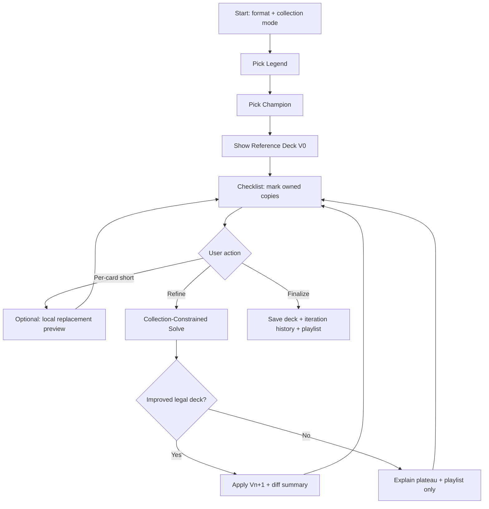
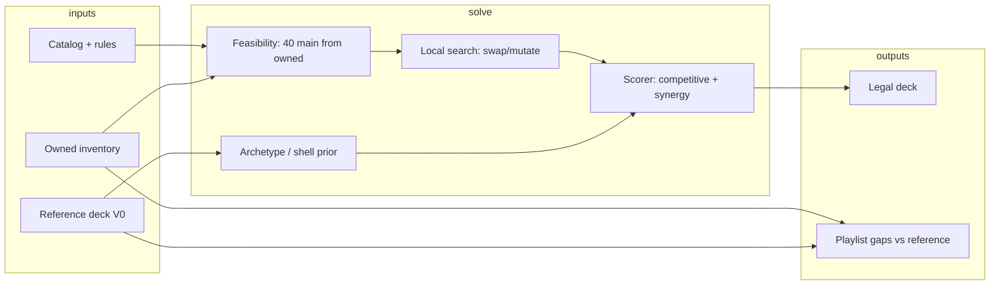

# Riftbound Guided Deck Wizard — Product & Architecture Spec

**Status:** Draft for implementation / model redesign  
**Audience:** Engineers, ML designers, and agents implementing the Deckbuilding Wizard in `riftbound-deck-platform-v2`  
**Last updated:** 2026-05-21

---

## 1. Executive summary

The **Guided Deck Wizard** helps a player build the **strongest legal deck they can actually play** for a chosen **Legend + Chosen Champion**, given a honest snapshot of what they own. It is **not** a one-shot “meta optimal deck + shopping list” flow.

The experience should feel like **iterative coaching**:

1. Start from a strong **reference** list (meta / ML template).
2. User marks **owned copy counts** (partials allowed).
3. System **re-solves** the deck under collection + rules constraints.
4. User repeats until the list **stabilizes** or is **fully buildable**.
5. **Upgrade ideas** (Spotify-style playlist) persist for future sessions — cards to acquire later, not cards jammed into the current illegal list.

Today’s implementation bolts iterative UI onto the existing **Auto Builder** (`recommend` / `complete` / per-card `suggest_replacements`) without a **collection-constrained deck solver**. That produces failures like: refinement claiming “no better fully-owned list” at 81% match, **illegal 4-of copies after swap**, and replacement suggestions that ignore copy limits and deck size.

This document defines the **target product**, **non-negotiable rules**, **UX**, and a **recommended model/API architecture** to replace the current patchwork.

---

## 2. Problem statement (observed failures)

### 2.1 Example session (LeBlanc — Deceiver / Fragmented)

After iteration 1 the UI shows:

- **81% collection match**, message: *“No better fully-owned list yet”*
- Most slots owned; shorts include **Karthus - Eternal (0/3)**, **Sacrifice (0/2)**, partial **Tactical Retreat (1/3)**, **Mirror Image (1/3)**
- User swaps a missing card via **Replacements**; checklist then shows **Deathgrip 4x** — **illegal** in Constructed (`main_copy_limit: 3`)

### 2.2 Root causes (code-level)

| Failure | Mechanism |
|--------|-----------|
| Illegal copy counts after swap | `performWizardSwap` **adds** replacement qty to existing: `deck.main[repl] = (deck.main[repl] \|\| 0) + qty` with **no** validation or cap |
| Refine does not fix obvious gaps | `runWizardRefinement` only applies `recommendations[0]` from `onlyBuildable: true`; if generator returns nothing buildable, **deck unchanged** despite many owned substitutes |
| “Replacements” ≠ “refine” | Per-card `complete` → `suggest_replacements` ranks **single-card swaps**; does not rebalance 40-card main, curve, domains, or copy limits globally |
| Playlist pollutes checklist | Hybrid `missingCards` / `replacementSuggestions` appended to playlist without **legality** or **“already in deck at cap”** checks |
| No legality gate in wizard | Builder tab uses `validate_deck`; wizard checklist does **not** block save/refine on illegal lists |
| `only_buildable` mode | `strict_buildable` filters **plans**, not a true **IP solver** over owned inventory; empty or weak results are common |

---

## 3. Product goals

### 3.1 Primary goal

> **Maximize competitive strength** of a **rules-legal** deck subject to:  
> `∀ card c: count_in_deck(c) ≤ owned(c)` (and format copy limits, domain rules, deck sizes).

### 3.2 Secondary goals

- **Transparency:** Every iteration shows *what changed*, *why*, and *% buildable*.
- **Progressive optimality:** Each refine step should **not worsen** buildability; ideally strictly improve until fixed point.
- **Persistent upgrade path:** Cards the user **does not own** but that improve the **reference template** are saved as **future recommendations** — never silently merged into the active list at illegal counts.
- **Respect player edits:** Manual swaps and copy steppers are **constraints** or **hints** for the next solve, not blind additive mutations.

### 3.3 Non-goals (v1 wizard)

- Price-optimized shopping / buy list as the **primary** end state
- Forcing collection-agnostic (“assume you own everything”) after champion pick
- Sideboard tuning for tournament meta (optional later)

---

## 4. User journey (target)



### 4.1 Step copy (UX)

| Step | Title | User understands |
|------|--------|------------------|
| 1 | Legend | “All legends available for guided build” (no ownership gate on legend) |
| 2 | Champion | “Only legal champions for this legend” |
| 3 | Reference deck | “This is the best **full-collection** template; we’ll adapt it to what you own” |
| 4 | Checklist | “Tell us what you actually have — partials count” |
| 5 | Refine | “We’ll rebuild the **whole list** legally using your cards” |
| 6 | Finalize | “This is the strongest deck **you can play today**; upgrade ideas saved for later” |

### 4.2 Iteration semantics

- **Iteration counter** increments only on **Refine** (not on every +/-).
- **Plateau:** If `completion_pct` gain &lt; 1% vs previous iteration **and** solver reports optimality within owned pool → enable **Finalize** with clear copy.
- **Never show “No better fully-owned list”** if the current deck still has **missing required copies** — message should be: *“Couldn’t find a full 40-card legal build from owned cards only; applied partial improvements”* or run **partial solver** (below).

---

## 5. Riftbound rules (hard constraints)

Every candidate deck and every swap **must** pass `validate_deck` (see `app/domain/validator.py`) before display or apply.

**Constructed defaults (verify against live rules JSON):**

| Constraint | Typical value |
|------------|----------------|
| Main deck size | 40 cards exactly |
| Rune deck size | 12 runes |
| Battlefields | 3 distinct |
| Main copy limit | 3 per card (main) |
| Combined main+side limit | 3 per title |
| Domains | Match legend/champion eligibility |
| Card types | Main: Unit/Gear/Spell; runes; battlefields |

**Inventory constraints (wizard-specific):**

- For each title `t` in deck: `qty_deck(t) ≤ qty_owned(t)` unless user explicitly marks “planning to use proxy” (future).
- **Runes:** Wizard assumes **all runes owned** (product decision) — still must respect 12 runes and domain.

**Banned list:** Enforce `BANNED_CARDS` in UI and solver (same as builder).

---

## 6. UX requirements

### 6.1 Checklist

- Portrait card art (tile-grid), no hover preview tooltip on pick steps.
- Copy steppers bound to **owned ≤ required** for display; allow marking **owned &gt; required** in collection editor but deck list **caps at required** after solve.
- **Legality strip** at top: Legal / Illegal + first 3 issue codes (reuse builder validation panel patterns).
- **Replacements panel:** Only show options that satisfy:
  - `validate_deck` after **1:1 swap** (same quantity)
  - `qty_after_swap(replacement) ≤ copy_limit`
  - `qty_after_swap(replacement) ≤ owned(replacement)` if strict build mode
- After swap: **replace** quantity, do not **add** (`qty_new = qty_old`, not `qty_old + qty_existing`).

### 6.2 Refine action

- Loading state with explicit phases: *Validate → Solve owned-only → Score → Diff*
- Post-refine **diff card:** Added / removed / qty changed (max 12 lines + “and N more”).
- If illegal after refine → **do not apply**; show errors.

### 6.3 Saved upgrade ideas (“playlist”)

- **Not** mixed into main checklist quantities.
- Separate panel: card, reason, priority score, “needed copies”, optional link to template card it replaces.
- Persist **server-side** per `(user_id, legend_title)` for cross-device + ML feedback (localStorage is interim only).

### 6.4 Finalize

- Summary: iterations, final completion %, competitive score estimate.
- Save to library (existing `/api/decks/library`).
- Optional acquisitions = playlist items **only**, not re-listing every missing slot in the active deck.

---

## 7. Current architecture (baseline)

```
Web wizard (app.js)
  → POST /api/auto-builder/recommendations  (only_buildable flag)
  → POST /api/auto-builder/complete         (recommend + suggest_replacements)
  → POST /api/decks/analyze                 (missing cards, costs)

AutoBuilderRepo (auto_builder_repo.py)
  → build_generation_plans + hybrid generate_pure / seed_adapt / prototype
  → rank by collection / competitive / hybrid
  → NO global "owned-set" constraint during generation (only_buildable filters plans)

Validator (validator.py) — used in builder, NOT wired into wizard apply path
```

**Training artifacts:** `artifacts/auto_builder/` — shells, archetypes, MoE scorer, replacement ranker (`rank_replacements_for_missing_card`).

---

## 8. Target architecture: Collection-Constrained Deck Solver (CCDS)

The wizard needs a **dedicated solve endpoint**, not a reuse of “top-1 recommend deck”.

### 8.1 API surface (proposed)

```
POST /api/wizard/solve
```

**Request:**

```json
{
  "legendTitle": "LeBlanc - Deceiver",
  "chosenChampionTitle": "LeBlanc - Fragmented",
  "format": "constructed",
  "owned": { "Deathgrip": 4, "Karthus - Eternal": 0, ... },
  "referenceDeck": { ... },           // optional V0 template
  "currentDeck": { ... },             // optional starting point
  "locks": ["LeBlanc - Fragmented"],  // never remove
  "swaps": [{ "from": "Karthus - Eternal", "to": "Deathgrip" }],
  "mode": "owned_only" | "owned_plus_acquisitions",
  "maxIterations": 1
}
```

**Response:**

```json
{
  "deck": { ... },
  "validation": { "is_valid": true, "issues": [] },
  "metrics": {
    "completionPct": 100,
    "isFullyOwned": true,
    "competitiveScore": 0.78,
    "mainDeckCurve": {}
  },
  "diff": { "added": [], "removed": [], "qtyChanges": [] },
  "explanations": [],
  "playlist": [
    { "card": "Mirror Image", "reason": "Template slot; +2 owned → +0.04 score", "priority": 0.82 }
  ],
  "solverStatus": "optimal" | "feasible" | "infeasible_owned_only"
}
```

### 8.2 Solver stages (recommended pipeline)



**Stage A — Feasibility (must-have):**

- Decision variables: integer `x_c` = copies of card `c` in main, subject to `0 ≤ x_c ≤ min(owned_c, copy_limit_c, domain_legal_c)`.
- Linear constraint: `Σ x_c = 40` (main).
- If **infeasible**, return `solverStatus: infeasible_owned_only` + best **partial** deck (e.g. maximize owned-weighted count toward 40) — never pretend “no improvement.”

**Stage B — Seed from reference:**

- Start from `referenceDeck` main multiset; for each missing/partial slot, run **bounded replacement** (`rank_replacements_for_missing_card`) but apply with **validate** and **copy caps**.

**Stage C — Local search / beam:**

- Mutations: 1-for-1 swap same cost band, same domain, same card type; 2-card bundle swaps from synergy clusters.
- Score with existing `competitive_score` + `ranking_score` from Auto Builder bundle.
- Reject illegal children immediately.

**Stage D — Playlist generation:**

- Compare **reference** vs **solved** deck; for each template card `t` where `owned(t) < template_qty(t)`, emit playlist row (never add to solved deck).

### 8.3 Model architecture options

| Option | Description | Pros | Cons |
|--------|-------------|------|------|
| **A. Rules + search (v1)** | ILP/heuristic + existing rankers | Fast to ship, explainable, legal-by-construction | May miss global synergy |
| **B. Set transformer** | Encode owned bag + legend → 40-card multiset | Learns synergies | Needs large training data, legality mask |
| **C. Two-tower retrieve + solve** | Retrieve 50 meta decks → CCDS project to owned | Reuses meta index | Two-stage latency |
| **D. RL / MCTS** | Simulate deck edits | Strong when tuned | Expensive, hard to debug |

**Recommendation:** Ship **A + C** for wizard v2: meta retrieval for reference V0, **CCDS** for every refine. Train **B** offline only when logged wizard sessions &gt; 50k.

### 8.4 Training signals (future)

Log per iteration:

- `owned_snapshot`, `deck_before`, `deck_after`, `validation`, `user_swaps`, `finalize`
- Label: user kept finalize deck vs reverted
- Playlist: which recommendations user clicked / acquired later

Use for:

- Replacement ranker fine-tuning
- `buildability_prior` per shell
- Optional set model

---

## 9. Replacement vs refine (product rules)

| Action | Scope | Must |
|--------|--------|------|
| **Replacement (card)** | Single slot, same total qty | `validate_deck` after swap; `qty` preserved; no merge-add |
| **Refine (deck)** | Full main + support zones | Call `/api/wizard/solve`; apply only if legal |
| **Playlist add** | Out-of-band | Never changes deck JSON |

**UI rule:** Hide replacement option if `owned(replacement) < qty_needed` **unless** mode is `owned_plus_acquisitions` (playlist preview only).

---

## 10. Acceptance criteria

### 10.1 Correctness

- [ ] No deck shown in checklist with any card &gt; `main_copy_limit` (unless format allows).
- [ ] After any swap, `validate_deck.is_valid === true` OR inline error with issue code `MAIN_COPY_LIMIT`.
- [ ] `performWizardSwap` semantics: **replace** `qty` at slot, not sum into existing title.
- [ ] Refine with LeBlanc example at 81% **must** either improve completion % or return `infeasible` with partial best + explicit playlist — **never** “no better list” with 0/3 slots still in deck.

### 10.2 Iteration

- [ ] User can refine ≥3 times without scroll reset bugs (preserve checklist scroll).
- [ ] Iteration history stored: before/after completion %, deck hash, solver status.
- [ ] Finalize enabled after ≥1 refine OR 100% owned legal deck.

### 10.3 Playlist

- [ ] Deathgrip at 4 owned does **not** appear as 4x in deck unless legal and required.
- [ ] Playlist items deduped by card title; sorted by priority.

### 10.4 Performance

- [ ] Solve p95 &lt; 3s offline mode, &lt; 6s online
- [ ] Rate limit: 20 refine/min/user

---

## 11. Implementation phases

### Phase 0 — Hotfixes (1–2 days)

- Fix swap merge-add bug in `performWizardSwap`.
- Run `validate_deck` before/after swap and refine apply; block illegal UI state.
- Cap steppers at `min(owned, required, copy_limit)`.
- Fix refine messaging when deck still has missing copies.

### Phase 1 — `/api/wizard/solve` feasibility solver (1 week)

- Owned-only 40-card feasibility + greedy fill from reference.
- Wire wizard Refine to solve endpoint.
- Playlist generation decoupled from checklist.

### Phase 2 — Search + explain (1–2 weeks)

- Local search with synergy clusters; diff + explanations.
- Server-side playlist persistence.

### Phase 3 — Model v2 (optional)

- Set transformer or retrieve+solve at scale; train on wizard logs.

---

## 12. Agent implementation prompt (copy-paste)

Use this block when handing work to a coding agent:

---

**Task:** Implement the Riftbound Guided Deck Wizard per `planning/riftbound-guided-deck-wizard-spec.md`.

**Context:** `riftbound-deck-platform-v2` — wizard in `web/app.js`, auto builder in `app/infra/auto_builder_repo.py`, validation in `app/domain/validator.py`.

**Priority order:**

1. **Legality everywhere in wizard** — validate before showing/applying deck; fix swap to preserve quantity without exceeding copy limits.
2. **Replace `runWizardRefinement`** — stop applying raw `recommendations[0]` only; call new solver that maximizes legal main deck from `transientCollection`, seeded from `optimalTargetDeck`.
3. **Split playlist from deck** — upgrade ideas never alter active deck counts.
4. **Honest iteration UX** — diff summary, correct plateau/infeasible messages, no “4x” illegal states.

**Do not** ship a buy-list-first complete step; finalize = save + playlist + optional acquisitions.

**Tests:** Add `tests/test_wizard_solver.py` with LeBlanc-style inventory: 0 Karthus, 4 Deathgrip owned, verify solver never outputs 4x Deathgrip in main unless legal; verify swap Karthus→Deathgrip at 3x stays at 3x max.

**Reference rules:** `main_copy_limit` from rules JSON; use `validate_deck` as source of truth.

---

## 13. Glossary

| Term | Meaning |
|------|---------|
| **Reference deck (V0)** | First ML/meta template before collection projection |
| **Owned-only solve** | Deck uses only cards with `qty_owned ≥ qty_deck` |
| **Playlist** | Future upgrade recommendations, not in active deck |
| **Refine** | Global re-solve, not single-card replacement |
| **Completion %** | `owned_copies_in_deck / required_copies_in_deck` (weighted by qty) |

---

## 14. Open questions

1. Should partial ownership (1/3) count as “playable” for refine, or force solver to cut to 1x owned only?
2. Sideboard: included in v1 wizard for constructed?
3. Signature cards / champion copies in main — special copy rules?
4. Sync playlist to Supabase for ML pipeline timing?

---

*End of spec.*
